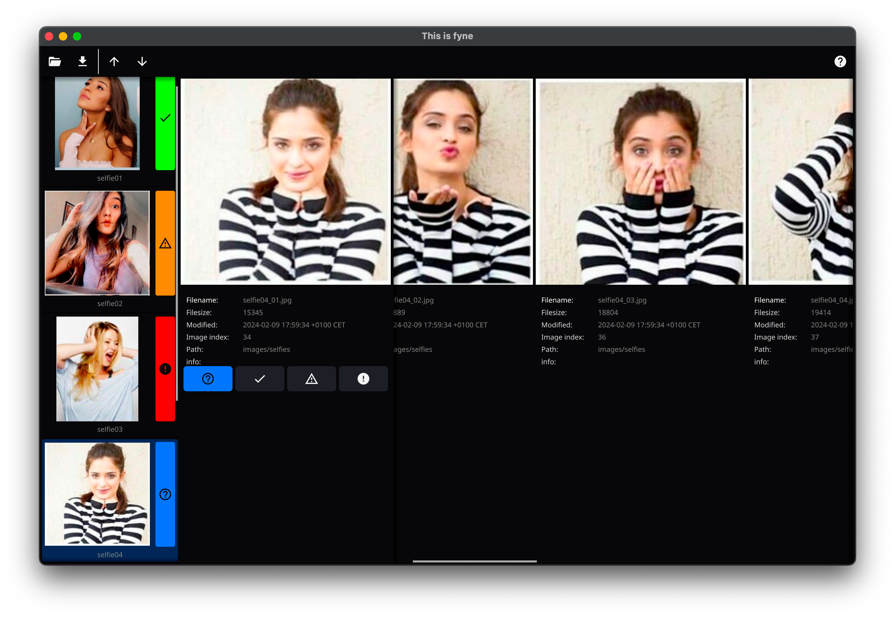

= This is Fyne

This is a project to try out and test the https://fyne.io/[*Fyne* UI library] for golang. +
(fyne version v2.4.3 in 2024-02-14)

== Screenshot

.This is a screenshot of my very fyne test application

== Build and run application

This project is developed using macOS and Makefile as build tool.

If you are using another OS and not using Makefile, you can most likely find out how to build the application by inspecting the `Makefile` and issue the commands manually.

=== Install go and Fyne

* Install go (duh!) +
  Use https://formulae.brew.sh/formula/go[brew] or use go https://go.dev/doc/install[download and install]
* Install Fyne dependencies. +
  Read the full getting started docs at the https://fyne.io/[fyne site]. +
  Basically it is: +
[source,bash]
----
    # ### Initialize modules for your project, if you have not already done so
    $ cd myapp
    $ go mod init MODULE_NAME

    # ### Download the Fyne module and helper tool
    $ go get fyne.io/fyne/v2@latest
    $ go install fyne.io/fyne/v2/cmd/fyne@latest

    # ### Finish by making sure all things are neat and tidy
    $ go mod tidy
----

=== Build

* Build with: `make all`

=== Run

* Run with: `./bin/thisisfyne` after build

=== Build MacOS app

You can use Fyne to build a MacOS application (with application icon).

* Build with `make macos-app`
* Look for the application (using Finder) in `./bin`directory and double-click it (or drag it to the Applications folder).

== License

This is supposed to be as free as possible under the https://creativecommons.org/public-domain/cc0/[Creative Commons Zero] (CC0).

image::documentation/cc-zero.svg[CC0]
