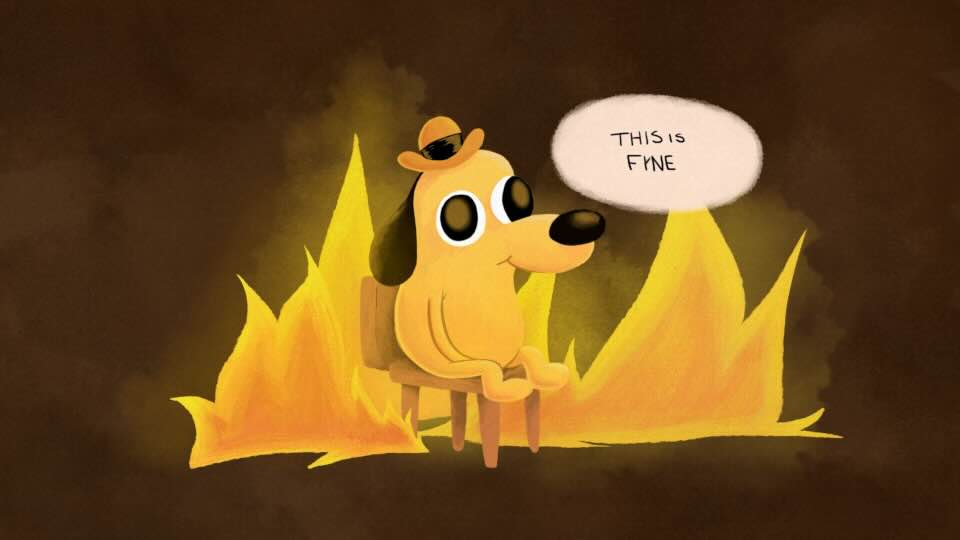

= This is fyne

This is a project to try out and test the https://fyne.io/[*fyne* UI library] for golang.

== Screen shot

.This is my fyne test application
image::documentation/screenshot.png[This is fyne - screen shot]

== Build and run application

* Install go (duh!)
* Install fyne dependencies. +
  Read the getting started docs at https://fyne.io/[fyne site].
* build with: `make all`
* run with: `./bin/thisisfyne` after build

